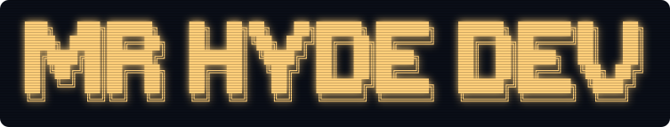

  

### `hyde@sunnydale:~$` whoami

Soy un **Software Engineer** al que le gusta construir cosas, experimentar y aprender cada día (¿tópico? Sí. Es lo que hay).

Cuando algo me interesa, quiero profundizar, saber por qué y cómo funciona al nivel más bajo que me permita mi IQ y mi tiempo libre (esto me sucede en **software, ciberseguridad, IA, fotografía**... realmente, en todos los aspectos de mi vida).

Me considero inquieto, buena persona y bastante terco (estoy trabajando en ello xD). Tengo tendencia a convertir cualquier curiosidad en un proyecto que, hasta ahora, acababa muriendo en algún repo privado.

Me importa mucho **la privacidad**, de ahí mi anonimato. Puedes llamarme **Hyde** :)

`└─ @MrHydeDev ▌`

### `hyde@sunnydale:~$` cat ~/.plan

Software engineer: construir, experimentar, aprender.

---

<a href="https://x.com/MrHydeDev">x.com/MrHydeDev</a> · <a href="https://mrhyde.dev">mrhyde.dev</a>

